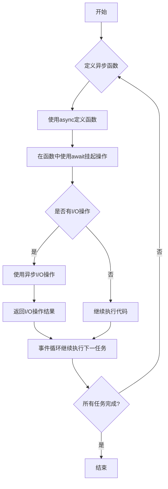

<!-- toc -->

## 背景介绍

在深入探讨Python异步编程之前，我们首先需要理解什么是异步编程以及它为什么如此重要。传统的编程模式大多是同步的，即代码的执行顺序严格按照它们在程序中的排列顺序，一个任务完成后，下一个任务才会开始。这种模式简单直观，但在处理大量并发请求或高延迟操作时，同步编程模型的效率低下成为了一个不可忽视的问题。

异步编程，顾名思义，允许程序在等待某些操作完成时继续执行其他任务。这种编程模式可以显著提高程序的性能和响应速度，特别是在涉及到I/O操作（如网络请求、文件读写等）的场景中。通过异步编程，我们可以让程序在一个任务等待外部操作完成时，不必阻塞地等待，而是去执行其他任务，从而充分利用系统资源，提高应用的吞吐量和用户体验。

### 同步编程与异步编程的对比

为了更好地理解异步编程的优势，让我们来比较一下同步编程和异步编程的主要差异：

- **阻塞与非阻塞**：在同步编程中，I/O操作（如读取文件、数据库查询等）会阻塞程序的执行，直到操作完成。而在异步编程中，这些操作是非阻塞的，程序可以在等待操作完成的同时执行其他任务。
- **性能**：因为异步编程减少了阻塞时间，所以通常能提供更好的性能。在面对大量并发请求时，这一点尤为重要。
- **复杂度**：异步编程的逻辑复杂度高于同步编程。正确地管理异步操作和错误处理通常需要更多的精力和对异步编程模型的深刻理解。

### 为什么选择Python进行异步编程

Python凭借其丰富的库和框架，如asyncio和aiohttp，提供了强大的异步编程支持。这些工具不仅简化了异步编程的实现，还使得编写高性能的网络应用成为可能。Python的这一优势，加上其简洁的语法和广泛的使用场景，使其成为进行异步编程的理想选择。

综上所述，异步编程是提高程序性能、优化资源使用、改善用户体验的关键。随着技术的发展，掌握异步编程已经成为每个Python开发者必备的技能之一。在接下来的章节中，我们将深入探讨Python的异步编程模型，通过理论与实战的结合，帮助你更好地理解和应用这一强大的编程范式。

## 环境准备

在深入探讨Python异步编程之前，我们需要确保开发环境已经妥善搭建，这对于后续实战案例的顺利进行至关重要。接下来，我会引导大家完成Python版本的确认及必要库与工具的安装过程。

### Python版本要求说明

首先，我们需要确认Python的版本。为了充分利用异步编程的特性，我们推荐使用Python 3.7及以上版本，因为从Python 3.7开始，asyncio模块被标记为稳定，其提供了完整的异步编程支持。可以通过下面的命令检查你的Python版本：

```
python --version
```


如果你的版本低于3.7，建议你通过官网下载最新版本进行更新。

### 必要的库和工具安装

异步编程涉及到的库主要是`asyncio`，它是Python用于解决异步IO编程的标准库，从Python 3.4版本开始引入，但在后续版本中不断得到改进。此外，`aiohttp`库也是我们实战中常用的一个异步HTTP客户端/服务器框架。接下来，让我们通过pip安装这些必要的库：

```bash
pip install asyncio
pip install aiohttp
```

请注意，`asyncio`作为Python的标准库，在Python 3.7及以上版本默认已经包含，因此可能不需要单独安装。但是，`aiohttp`需要单独安装。

安装好这些库之后，我们的环境就准备好了。通过以上步骤，我们不仅确保了Python环境的正确配置，也安装了异步编程过程中必不可少的库。接下来，我们就可以进入异步编程的精彩世界了。在后续章节中，我们将通过实战案例，深入理解异步编程的原理和应用，帮助你更好地在Python项目中运用这一强大的功能。

## 步骤详解

在深入理解Python异步编程之前，我们先要搞清楚几个关键概念：事件循环、`async` 和 `await` 关键字、构建异步函数，以及如何运行和调试异步程序。这些内容构成了Python异步编程的基础框架。

### 理解事件循环

事件循环（Event Loop）是异步编程的核心，可以理解为一个不断检查并执行任务的循环过程。在Python中，`asyncio` 模块提供了事件循环的实现，允许我们运行异步任务。简单来说，事件循环就是一个无限循环，它会持续检查并执行队列中的任务，直到没有任务为止。

```python
import asyncio

# 事件循环示例
async def main():
    print('Hello')
    await asyncio.sleep(1)
    print('world')

asyncio.run(main())
```

在这个例子中，`asyncio.run(main())` 开启了一个事件循环，并执行了 `main` 函数。`await asyncio.sleep(1)` 暂停了当前任务，让出控制权，允许其他任务运行。

### 使用 async 和 await 关键字

在Python中，`async` 和 `await` 是实现异步编程的两个关键字。`async` 用于定义一个异步函数，而 `await` 用于挂起异步操作的执行，直到操作完成并返回结果。

```python
# 异步函数示例
async def async_function():
    print('异步函数开始执行')
    await asyncio.sleep(1)
    print('异步函数执行完毕')

# 调用异步函数
async def main():
    await async_function()

asyncio.run(main())
```

在上述代码中，`async_function` 是一个异步函数，它使用 `await` 挂起了执行流程，等待 `asyncio.sleep(1)` 完成。这使得其他任务有机会在此期间执行。

### 构建异步函数

构建异步函数的关键在于理解何时使用 `async` 定义函数，以及如何合理地使用 `await` 表达式。异步函数通常用于执行I/O操作，比如网络请求、文件读写等，因为这些操作的延迟较高，使用异步可以提高程序的整体效率。

```python
# 异步获取网页内容
async def fetch_page(url):
    async with aiohttp.ClientSession() as session:
        async with session.get(url) as response:
            return await response.text()

# 主函数
async def main():
    content = await fetch_page('http://example.com')
    print(content)

# 运行
asyncio.run(main())
```

在这个例子中，`fetch_page` 函数异步获取一个网页的内容。使用 `async with` 确保资源的正确管理（比如网络连接的关闭）。

### 运行和调试异步程序

运行异步程序通常使用 `asyncio.run()` 函数，这个函数会创建一个新的事件循环，运行传入的协程，直到完成。但在实际开发中，调试异步程序可能会比同步代码更加复杂，因为程序的执行不再是线性的。Python的标准库中包含了多种工具来帮助调试，比如日志(logging)和断点(pdb)。

```python
import logging
import pdb

logging.basicConfig(level=logging.INFO)

async def buggy_function():
    logging.info("Before bug")
    pdb.set_trace()
    await asyncio.sleep(1)
    logging.info("After bug")
    1 / 0  # 故意制造错误

asyncio.run(buggy_function())
```

在这个例子中，我们使用了 `logging` 来记录程序的运行信息，`pdb.set_trace()` 设置了一个断点，这允许我们在程序执行到该点时进行交互式调试。

### 图表需求：流程图

为了更好地理解异步编程的工作流程，我们可以通过下面的流程图来形象地展示：



通过这个流程图，我们可以清晰地看到异步编程的工作方式：定义异步函数、在需要等待的地方使用 `await` 挂起、利用事件循环高效地管理多个任务的执行。

通过理解这四个关键步骤，你已经掌握了Python异步编程的基础。接下来，通过实际的编程实践，你将能够更加深入地理解和运用这些知识。

## 常见问题

在Python异步编程的学习和实践过程中，我们经常会遇到一些问题，如阻塞调用的处理、异常处理和调试技巧，以及性能优化的方法。本章节将深入解析这些问题，并提供实用的建议和解决方案。

### 阻塞调用的处理

在异步编程中，阻塞调用是一个常见的问题，它会阻止事件循环的执行，从而影响程序的性能。如何处理阻塞调用是我们需要关注的问题。

#### 解决方案：

- 使用`asyncio.to_thread()`将阻塞的操作放在不同的线程中执行，以此来避免阻塞事件循环。

```python
import asyncio

async def main():
    loop = asyncio.get_running_loop()
    result = await loop.run_in_executor(None, blocking_io)
    print('default thread pool', result)

asyncio.run(main())
```

- 对于数据库操作等，可以使用异步的库（如`aiomysql`）来避免阻塞。

### 异常处理和调试技巧

异步编程中的异常处理和调试相比同步编程有所不同，需要掌握一些技巧。

#### 异常处理：

使用`try...except`语句块来捕获并处理可能出现的异常。

```python
import asyncio

async def fetch_data():
    raise Exception("fetch data error")

async def main():
    try:
        await fetch_data()
    except Exception as e:
        print(f"Error: {e}")

asyncio.run(main())
```

#### 调试技巧：

1. 使用`asyncio`模块的`debug`模式来运行程序。可以在运行时添加环境变量`PYTHONASYNCIODEBUG=1`，或是在程序中设置`loop.set_debug(True)`。
2. 利用日志(logging)来记录程序的运行情况，特别是在执行异步操作时。

### 性能优化建议

在异步编程中，性能优化是一个重要的话题。以下是一些优化建议：

1. **合理使用并发**：并不是并发越多越好，需要根据实际情况来调整并发的数量。过多的并发可能会导致资源竞争，从而降低性能。
2. **避免不必要的网络请求**：在进行网络编程时，应尽量减少不必要的网络请求，比如通过缓存机制来避免重复请求。
3. **使用专门的异步库**：对于数据库操作、文件操作等，应当使用支持异步操作的库，以避免阻塞。

### 总结

通过上述的讨论和示例代码，我们了解到在Python异步编程中处理阻塞调用、异常处理和调试以及性能优化的方法和技巧。正确地处理这些问题，能够帮助我们更好地利用异步编程的优势，提升程序的性能和可维护性。希望这些内容能够帮助你在异步编程的道路上更进一步。

## 总结展望

在本篇文章中，我们深入探讨了Python异步编程的各个方面，从背景介绍到环境准备，再到具体的步骤详解，最后解答了在异步编程实践中可能遇到的一些常见问题。通过对这些内容的学习，相信读者已经对Python异步编程有了较为全面的了解和掌握。

异步编程作为提高程序性能，特别是在I/O密集型应用中的关键技术，已经证明了其重要性。随着现代软件开发对性能和资源利用率要求的日益增长，异步编程不仅仅是一种选择，更是一种必然趋势。Python语言通过`asyncio`库，为开发者提供了强大的异步编程支持，让开发者能够更加高效地编写高性能的应用程序。

### 未来趋势

未来，随着硬件性能的持续提升和软件架构的不断演进，异步编程将会更加广泛地应用于各种复杂的应用场景中。我们预见到以下几个趋势：

1. **集成与简化**：随着异步编程的普及，各种框架和库将会提供更为简洁和集成化的异步支持，让开发者可以更加容易地采用异步编程。
2. **性能优化**：异步编程库本身也在持续优化中，未来将会有更多的性能改进，以适应更高的并发需求和更复杂的业务逻辑。
3. **教育和文档**：随着异步编程变得越来越重要，相关的教育资源和文档也将越来越丰富，帮助更多的开发者入门和提升。

### 面临的挑战

虽然异步编程带来了许多好处，但在广泛应用的过程中也面临一些挑战：

1. **学习曲线**：对于习惯了同步编程模式的开发者来说，异步编程的概念和实践需要一定时间去适应和掌握。
2. **调试和测试**：异步编程的调试和测试相较于同步编程更为复杂，需要开发者具备更多的知识和技能。
3. **生态兼容性**：虽然越来越多的第三方库支持异步，但仍有部分库尚未提供异步支持，这对于一些项目来说可能是一个限制。

### 结语

总而言之，Python异步编程是一个强大且灵活的工具，能够帮助开发者构建出高性能的应用。通过本篇文章的学习，希望读者能够对异步编程有更深入的理解，并能够在实际项目中灵活运用。同时，也希望大家能够持续关注异步编程的未来趋势，面对挑战，不断学习和进步，开发出更加优秀的软件产品。

