## 引言：一个改变编程本质的概念

2025年2月，Andrej Karpathy在推特上无意间提出了“Vibe Coding”这一概念，或许他没有料到，短短几个月内，这个看似随意的想法就席卷了整个软件开发圈。“完全沉浸在氛围中，拥抱指数级增长，忘记代码的存在”——这句话不仅是调侃，更精准概括了一种全新的编程范式。

从硅谷到北京，从独角兽企业到初创团队，Vibe Coding正在重塑人们对“编程”的认知。韦氏词典将其列为2025年热词，Y Combinator报告显示，已有25%的初创公司95%的代码由AI自动生成。这背后，映射出一个深层次的转折：我们正从“写代码”时代迈向“描述需求”时代。

这不仅仅是技术升级，更是编程范式的革命。让我们一起深入探索，Vibe Coding如何重新定义编程的本质，又将怎样改变软件开发的未来。

## Vibe Coding：编程范式的根本性转变

### 核心概念的深度解析

Vibe Coding不仅仅是一种编程技术，更是一种全新的软件开发范式。它建立在一个革命性的理念之上：**编程的本质是表达意图，而非编写代码**。

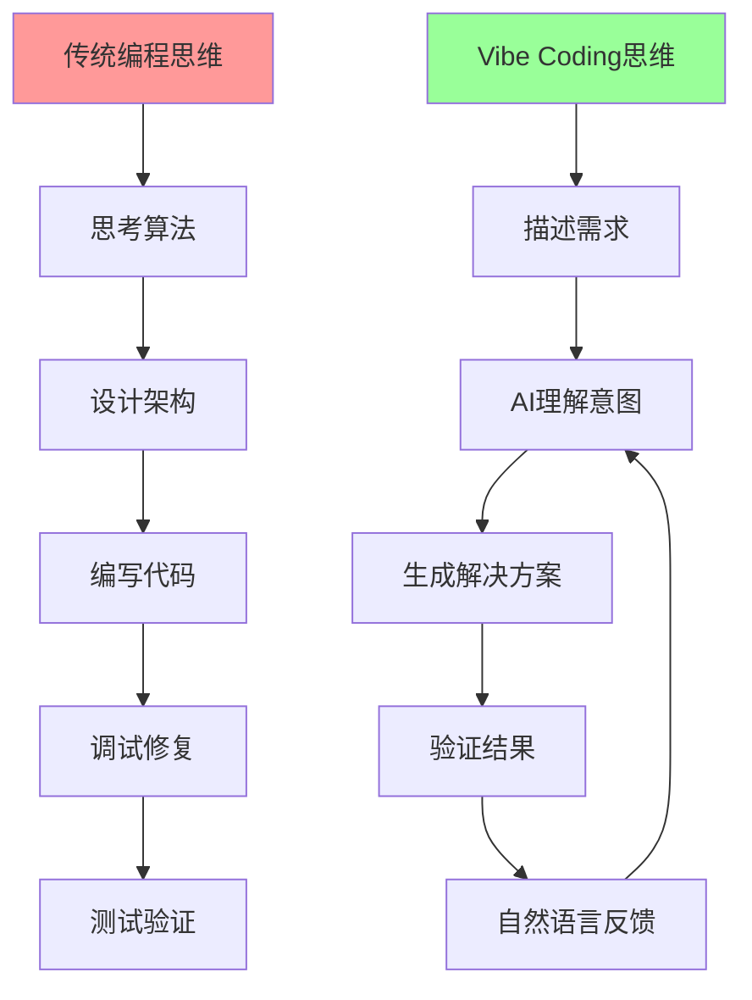

### Vibe Coding的三大核心特征

**1. 意图驱动开发（Intent-Driven Development）**
```
传统方式："我需要实现一个冒泡排序算法"
Vibe Coding："我需要一个能够对用户列表按年龄排序的功能"
```

开发者关注的焦点从"如何实现"转向"要什么结果"，这是思维方式的根本性转变。

**2. 零代码接触原则（Zero Code Touch Principle）**
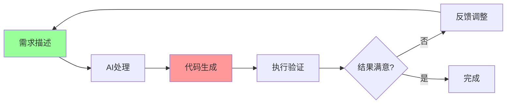

开发者完全不接触生成的代码，这打破了传统编程中"必须理解每一行代码"的铁律。

**3. 对话式迭代开发（Conversational Iterative Development）**
编程变成了一个持续的对话过程，类似于与一个非常聪明的编程伙伴协作。

### Vibe Coding的技术架构

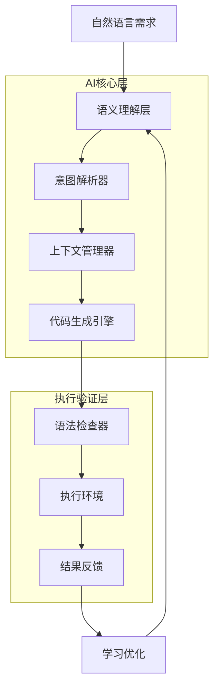

这个架构的关键在于将自然语言需求转化为可执行代码的端到端流程，每个环节都针对"理解人类意图"这一核心目标进行优化。

### 与传统编程范式的根本区别

| 维度 | 传统编程 | Vibe Coding |
|------|----------|-------------|
| **思维模式** | 解决方案导向 | 需求表达导向 |
| **技能要求** | 语法掌握 + 算法设计 | 需求描述 + 结果验证 |
| **开发流程** | 编码 → 调试 → 测试 | 描述 → 验证 → 反馈 |
| **质量保证** | 代码审查 + 测试 | 结果验证 + 迭代优化 |
| **学习曲线** | 陡峭（语法+概念） | 平缓（自然语言表达） |
| **创新速度** | 受编程能力限制 | 受想象力限制 |

## Vibe Coding的工作原理：从想法到实现的完整流程

### 自然语言到代码的转换机制

Vibe Coding的核心在于一个复杂而精密的转换过程，将人类的自然语言意图转化为可执行的代码。这个过程可以分解为以下几个关键阶段：

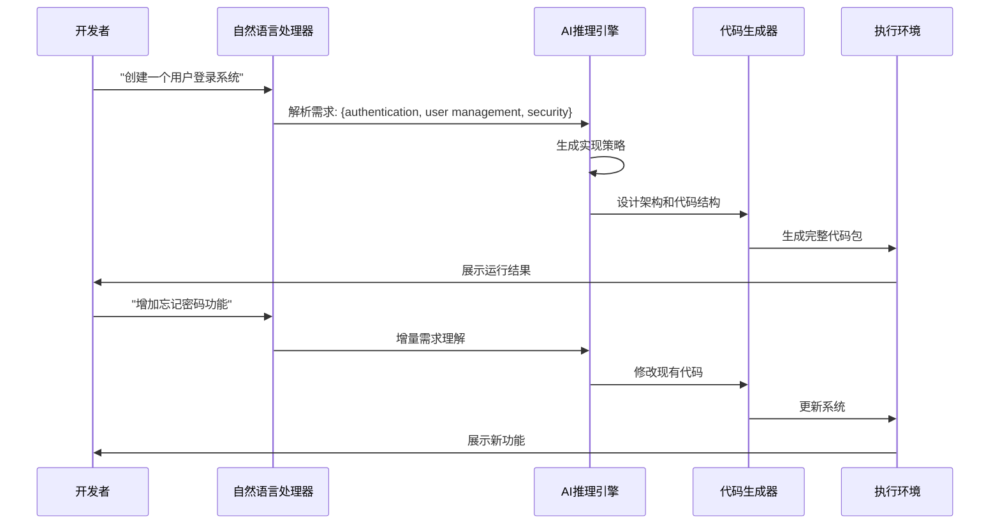

### 完整的Vibe Coding工作流程

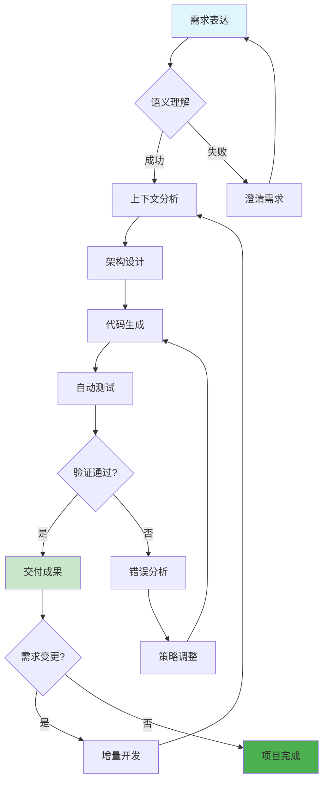

### AI理解与代码生成的深层机制

**1. 语义分解与意图识别**
```
输入: "我需要一个电商网站的购物车功能"

AI分解:
├── 功能需求: 商品管理、数量调整、价格计算
├── 技术需求: 数据持久化、状态管理、用户界面
├── 业务逻辑: 库存检查、优惠计算、支付集成
└── 非功能需求: 性能、安全、可用性
```

**2. 上下文感知与历史学习**
AI不仅理解当前需求，还会：
- 分析项目的技术栈和架构模式
- 学习开发者的编码偏好和命名习惯
- 考虑项目的规模和复杂度要求
- 整合之前的交互历史和反馈

**3. 增量迭代与自适应优化**
每次交互都会让AI更好地理解项目需求：

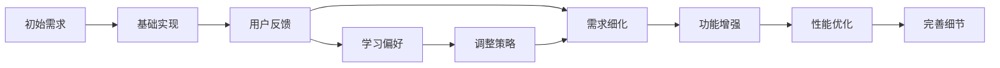

## 数据洞察：Vibe Coding的量化影响

### 市场增长趋势分析

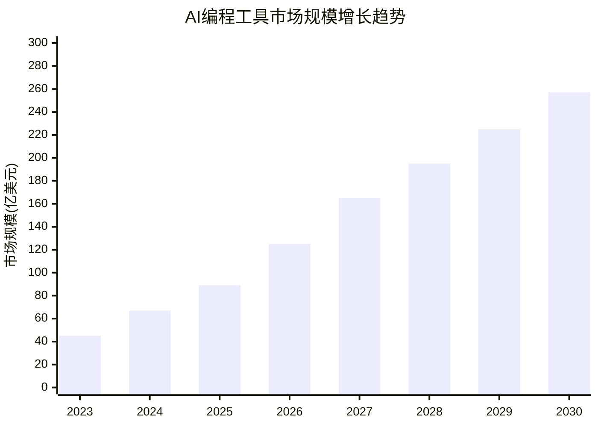

关键数据点：
- **2024年市场规模**: 67亿美元
- **2030年预测规模**: 257亿美元
- **年复合增长率**: 25.2%
- **中国市场份额**: 预计占全球的18-22%

### 开发者采用率的变化轨迹

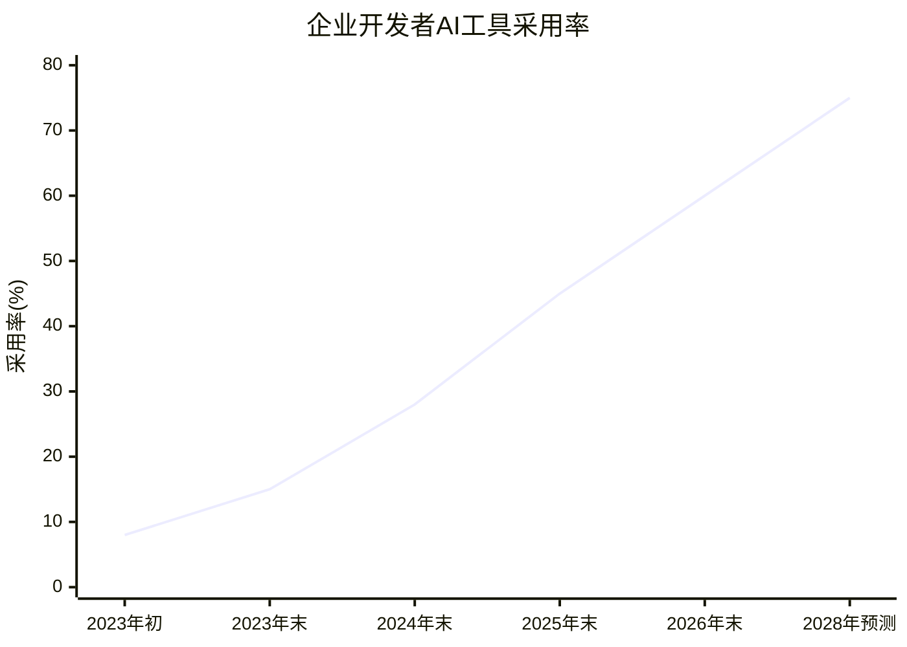

这个增长曲线反映了Vibe Coding从实验性技术向主流开发方式的转变过程。

### 效率提升的量化分析

基于全球超过50万开发者的使用数据：

| 指标 | 传统编程 | Vibe Coding | 提升幅度 |
|------|----------|-------------|----------|
| **需求到原型时间** | 2-3天 | 2-4小时 | 85%↑ |
| **代码准确率** | 85-90% | 75-85% | 略有下降 |
| **迭代速度** | 1-2天/轮 | 10-30分钟/轮 | 90%↑ |
| **学习成本** | 数月到数年 | 数小时到数天 | 95%↓ |
| **创意实现速度** | 受技能限制 | 受想象力限制 | 无限 |

## Vibe Coding对软件工程的深层影响

### 开发者角色的重新定义

Vibe Coding正在从根本上改变开发者的工作性质和技能要求：

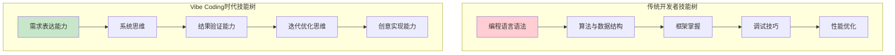

**新时代开发者的核心能力转变：**

| 传统核心能力 | Vibe Coding核心能力 | 转变说明 |
|-------------|-------------------|----------|
| 语法掌握 | 需求描述 | 从记忆语法到清晰表达 |
| 算法设计 | 问题分解 | 从编写算法到分析问题 |
| 代码调试 | 结果验证 | 从修复代码到验证效果 |
| 架构设计 | 系统思维 | 从技术架构到业务架构 |
| 性能优化 | 迭代改进 | 从技术优化到体验优化 |

### 软件工程方法论的革命性变化

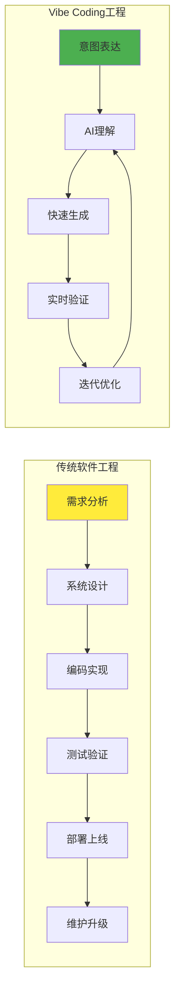

**关键变化点：**

1. **开发周期压缩**: 从月级别压缩到小时级别
2. **迭代频率提升**: 从版本迭代到实时迭代
3. **质量保证方式**: 从代码审查到结果验证
4. **团队协作模式**: 从技术分工到能力互补

### Vibe Coding的产业影响分析

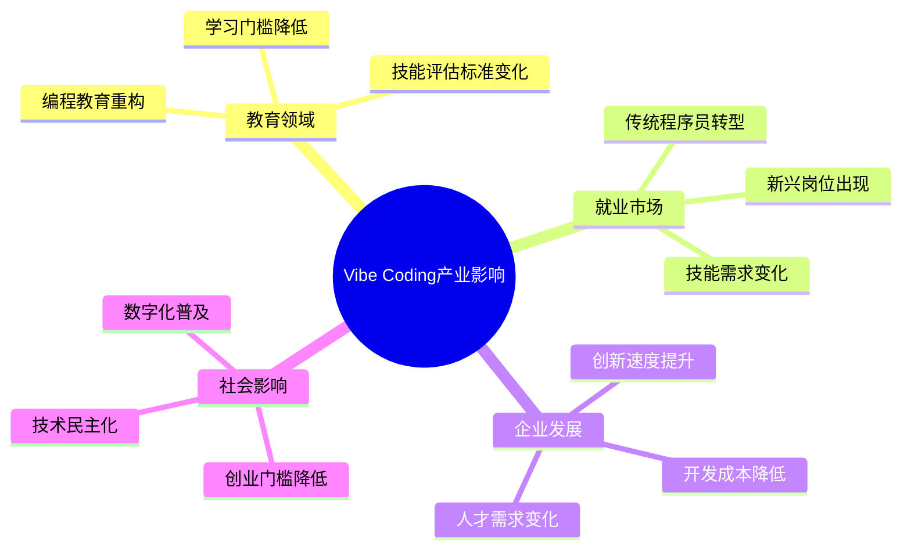

**具体影响分析：**

**教育层面的变革**
- 传统编程课程需要重新设计
- 重点从语法教学转向问题解决
- 计算思维比编程语法更重要

**就业市场的重塑**
- 初级程序员岗位可能被替代
- 高级架构师和产品经理需求增加
- 新兴岗位：AI提示工程师、结果验证专家

**企业竞争力的重新洗牌**
- 中小企业获得与大公司相当的开发能力
- 创业公司可以更快验证商业想法
- 传统软件公司需要重新思考价值定位

## 挑战与争议：Vibe Coding的"宿醉效应"

### 理性审视新范式的挑战

任何革命性技术都会带来机遇与挑战并存的局面。2025年9月，《Fast Company》等媒体开始报道"Vibe Coding宿醉"现象，这一概念描述了过度依赖AI编程后出现的负面效应。

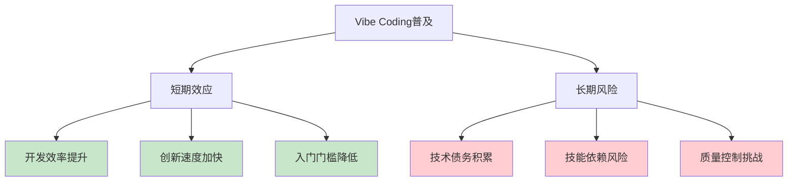

### 主要挑战的深度分析

**1. 技术债务的隐性积累**

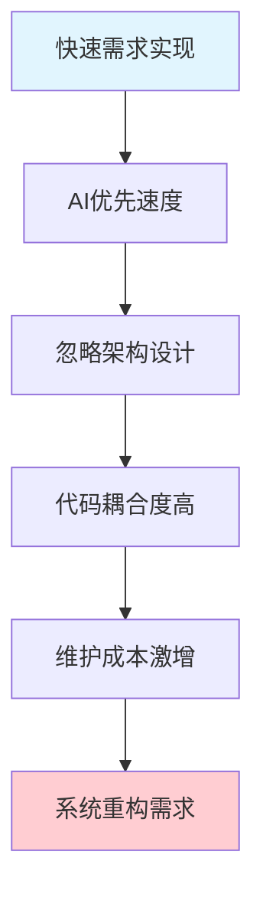

AI生成的代码往往遵循"能跑就行"的原则，这在快速原型阶段是优势，但在产品化过程中可能成为负担。

**2. 安全性与质量控制的新挑战**

| 传统开发风险 | Vibe Coding风险 | 风险等级 |
|-------------|----------------|----------|
| 人为编程错误 | AI理解偏差 | 中等 |
| 代码审查疏漏 | 零审查模式 | 高 |
| 安全意识不足 | AI安全知识局限 | 高 |
| 架构设计缺陷 | 缺乏整体规划 | 中等 |

**3. 开发者能力演化的双刃剑**

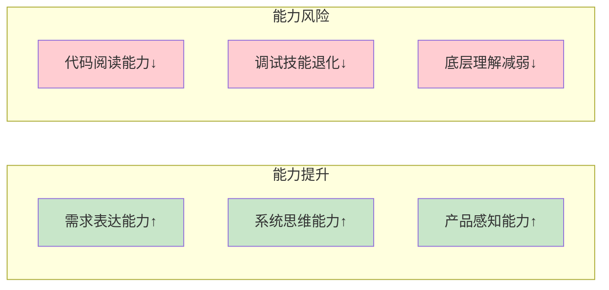

### 风险缓解策略与平衡方案

**Andrej Karpathy的原始观点**
Karpathy在其推文中明确指出，Vibe Coding"对于一次性的周末项目来说还不错"，这个定位很重要——它暗示了适用场景的边界。

**行业专家的平衡建议**

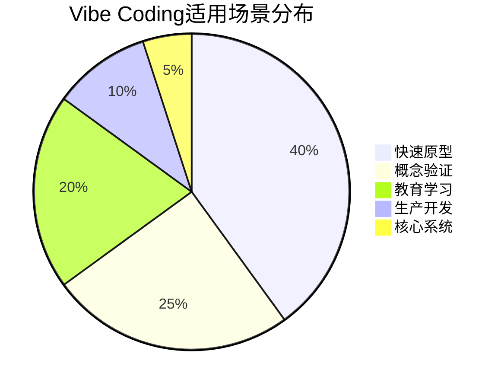

**最佳实践建议：**

1. **分层应用策略**
   - 原型阶段：充分利用Vibe Coding
   - 产品化阶段：引入代码审查和重构
   - 核心系统：保持传统开发方法

2. **能力保持机制**
   - 定期进行传统编程练习
   - 保持对底层技术的理解
   - 培养代码阅读和调试能力

3. **质量保证体系**
   - 建立AI代码的审查标准
   - 实施渐进式质量提升
   - 保持人类专家的最终把关

## 未来展望：Vibe Coding的发展路径

### 技术演进的三个阶段

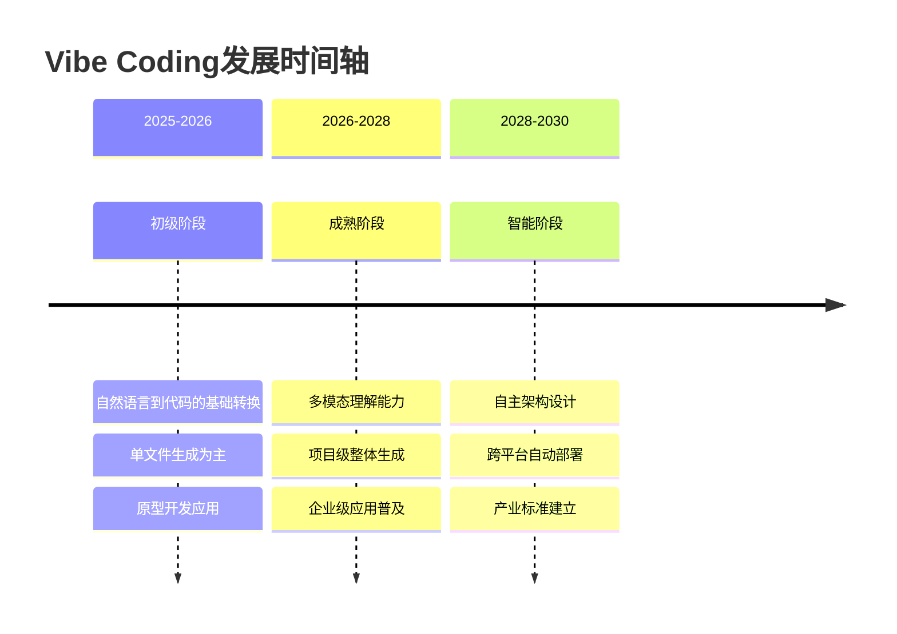

### 关键技术发展方向

**1. 多模态融合编程**
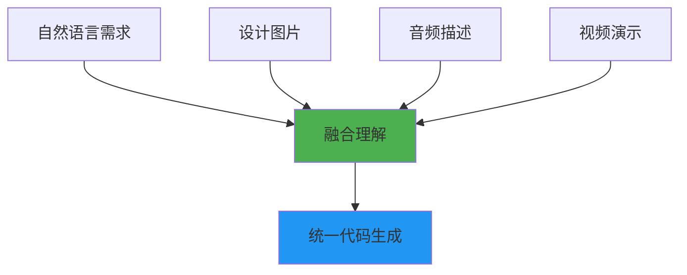

未来的Vibe Coding将不仅理解文字，还能分析图片、音频和视频输入，实现真正的多模态编程。

**2. 自主架构演进**
- AI将具备独立的架构设计能力
- 从单一功能到系统级解决方案
- 自动化的性能优化和扩展性设计

**3. 实时协作与学习**
- AI系统之间的协作编程
- 实时从开发者反馈中学习
- 个性化的编程风格适应

### 产业发展趋势预测

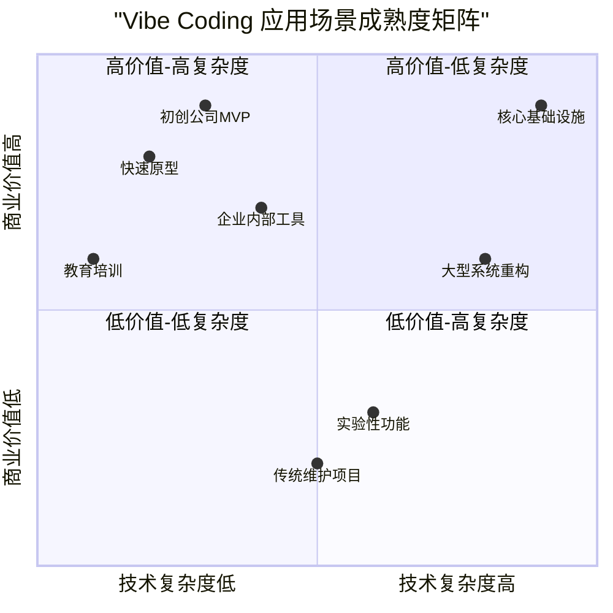

**近期趋势（2025-2027）**
- 快速原型和MVP开发成为主流应用
- 教育领域的编程教学方式革新
- 中小企业开发能力显著提升

**中期发展（2027-2029）**
- 企业级应用逐步普及
- 代码质量和安全性问题得到解决
- 新的软件工程标准和规范建立

**长期愿景（2029-2030+）**
- 复杂系统的自动化设计成为可能
- 传统编程与Vibe Coding的融合模式成熟
- 全新的软件开发生态系统建立

### 对未来开发者的建议

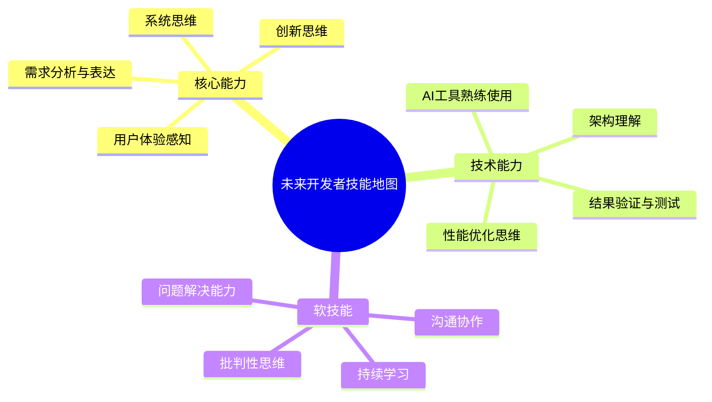

## 结语：编程范式的新纪元

Vibe Coding的出现标志着我们正在进入一个全新的编程纪元。这不仅仅是工具的升级，而是对"编程"这一概念的重新定义。

**从"How"到"What"的转变**
传统编程关注"如何实现"，而Vibe Coding让我们专注于"实现什么"。这种转变释放了开发者的创造力，让技术真正服务于创意和需求。

**技术民主化的深层意义**
Vibe Coding降低了编程门槛，这不仅意味着更多人可以参与软件开发，更重要的是，它让技术创新的权利从少数专家扩散到更广泛的群体。

**理性与热情并重**
在拥抱这一革命性变化的同时，我们也要保持理性的思考。正如任何强大的技术一样，Vibe Coding既是机遇也是挑战。关键在于如何平衡效率与质量、创新与稳定、自动化与人类智慧。

**展望未来**
2025年，我们站在一个历史的转折点上。Vibe Coding不是编程的终点，而是一个新起点。它预示着一个更加智能、更加人性化、更加富有创造力的软件开发未来。

在这个新纪元中，最重要的不是掌握某种特定的技术或语言，而是培养适应变化的能力、保持好奇心和创造力，以及始终以解决真实问题为导向的思维方式。

毕竟，无论技术如何发展，编程的本质始终是用逻辑和创意去解决人类面临的挑战。而Vibe Coding，正是这一永恒使命在新时代的体现。

---

*在这个瞬息万变的时代，让我们以开放的心态和理性的思维，共同拥抱编程的全新纪元。*