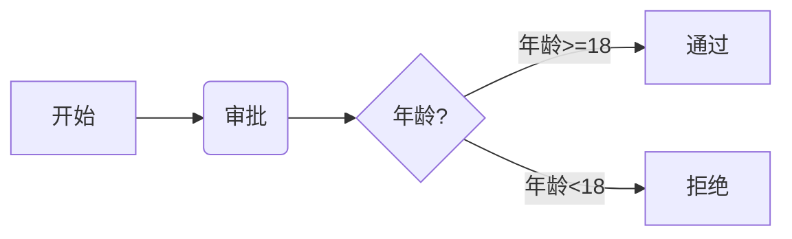
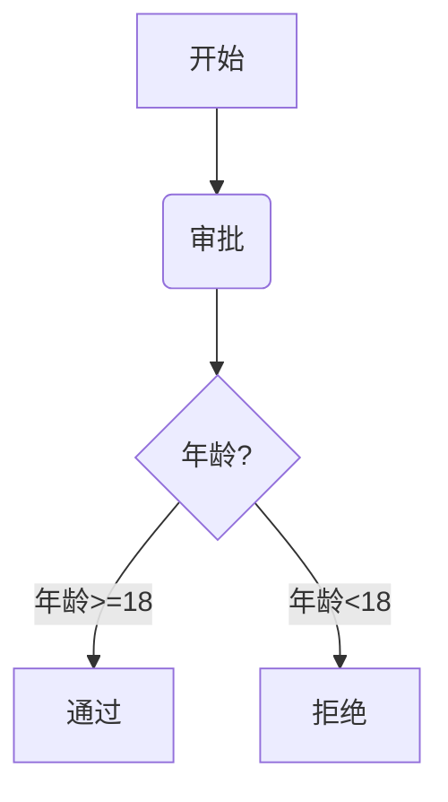
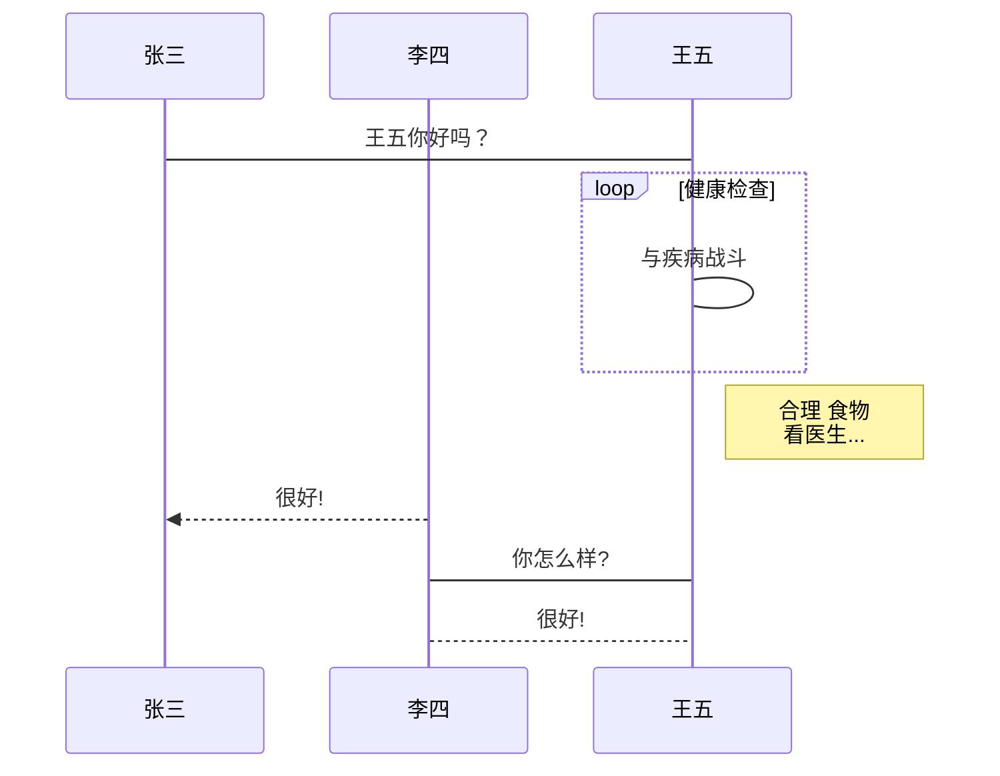
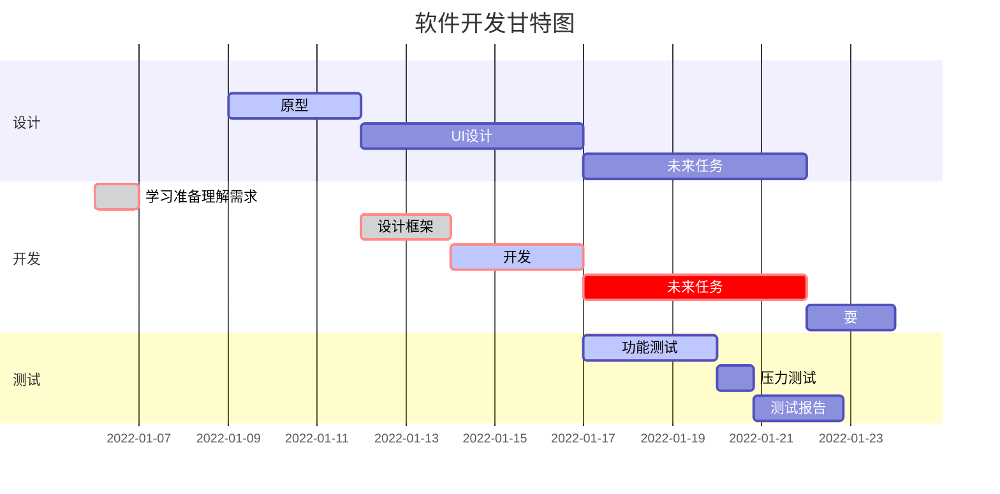
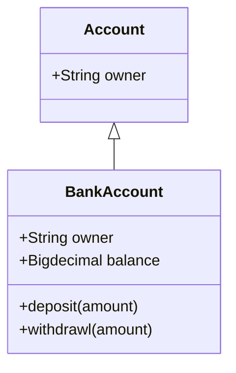
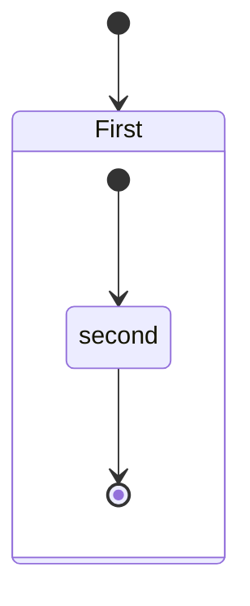
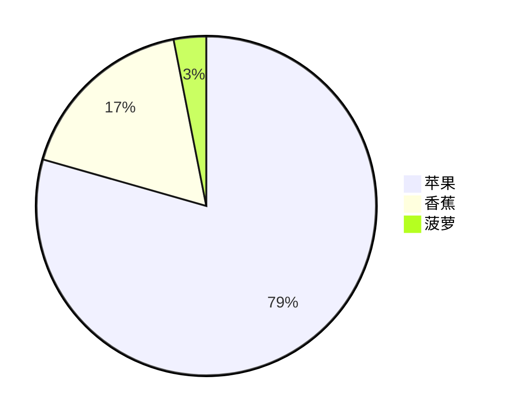
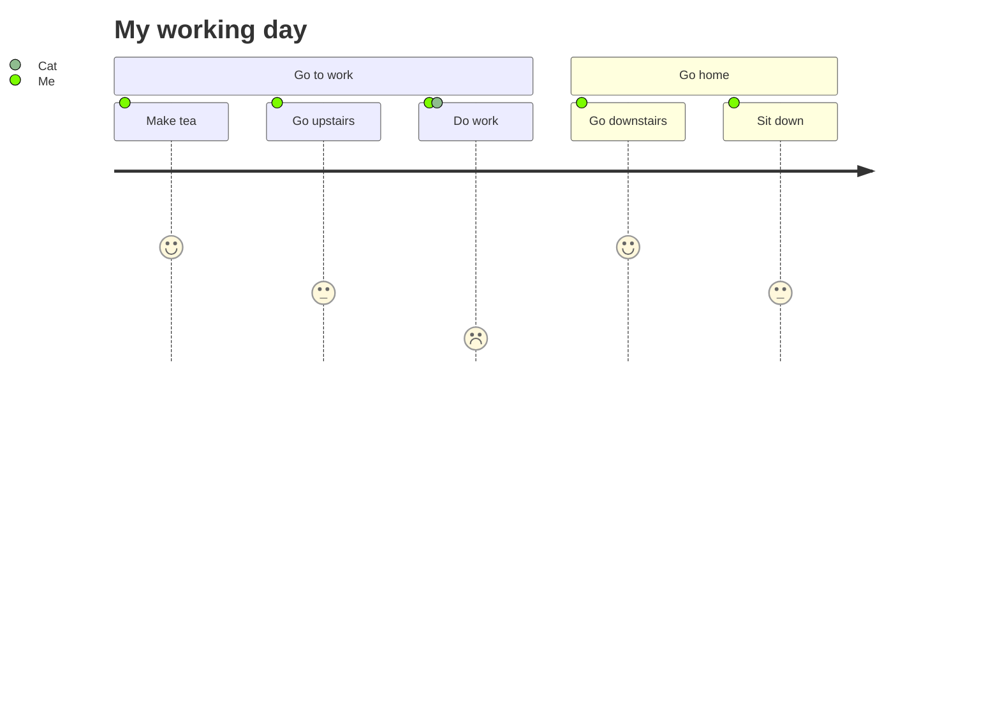

# 背景

工作、生活中有很多写文档的需求，如何才能提高写作效率？选择**合适的工具**加**恰当的方法**。下面分享一些工具和方法，为你的写作助力。

# 写作工具

对于我来说**MarkDown**+**思维导图**是一种效率极佳的写作方式。思维导图可以将我的思考清晰的展示，然后按照知识脉络完善文章内容。文章写作使用[MarkDown](https://www.markdownguide.org/basic-syntax/) ，[MarkDown 编辑工具](https://www.markdownguide.org/tools/)很多，经过使用比较我最终选择 [Typora](https://typoraio.cn/) + [MindNode](https://www.mindnode.com/) 。

Typora 正式版本已经开始付费，89元买断机制，免费版可以下载历史[Beta版本](https://typoraio.cn/releases/all)。


# 文档格式互转

有的时候，我们需要做文件的各种转换以满足展示场景，比如 Markdown转思维导图。

## Mind to Markdown

思维导图转换为 Markdown ，MindNode 和 XMind 这两个工具直接导出 Markdown格式文件即可。

## Markdown to Mind

使用 **[markmap](https://github.com/gera2ld/markmap)** 可以将 Markdown 转换为可视化、可交互的 HTML 格式的思维导图。

本文转换出来的效果如下


方式一：在线转换（https://markmap.js.org/repl）粘贴 markdown 到编辑区就可以导出Html或SVG。


方式二：在 vscode 中使用，安装插件（https://marketplace.visualstudio.com/items?itemName=gera2ld.markmap-vscode）

方式三：安装 markmap-cli 命令工具。

```bash
npm install -g markmap-cli
# 转换
markmap index.md -o index.html
```


## 万能转换

一个强大的命令行工具 **[Pandoc](https://pandoc.org/)**，用于将文件从一种标记语言转换为另一种标记语言。常用的标记语言包括 Markdown、ReStructuredText、HTML、LaTex、ePub 和 Microsoft Word DOCX。

在线转换地址（https://pandoc.org/try）。

Mac上直接使用 brew 安装

```bash
 brew install pandoc
```

支持格式如下：

```bash
Input formats:  native, json, markdown, markdown+lhs, rst, rst+lhs, docbook,
                textile, html, latex, latex+lhs
                
Output formats: native, json, html, html5, html+lhs, html5+lhs, s5, slidy,
                slideous, dzslides, docbook, opendocument, latex, latex+lhs,
                beamer, beamer+lhs, context, texinfo, man, markdown,
                markdown+lhs, plain, rst, rst+lhs, mediawiki, textile, rtf, org,
                asciidoc, odt, docx, epub
```


**Markdown 转 Html**

```bash
pandoc index.md -o index.html -c Github.css
```

**Markdown 转 Word**

```bash
pandoc index.md -o index.docx -c Github.css
```

**Markdown 转 PDF**，PDF 转换相对复杂一些。转换分两步骤，所以需要先安装[TeX Live](https://www.tug.org/texlive/) 或者 [MiKTeX](https://miktex.org/) 。

- 第一步， Markdown 文件被转为 LaTeX 源文件。
- 第二步，调用系统的 `pdflatex` （默认使用）, `xelatex` 或者其他 TeX 命令，将 `.tex` 文件转换为最终的 PDF 文件。

```bash
brew install texlive
pandoc index.md -o index.pdf
```

如果内容包含中文会出现如下报错，这是因为 Pandoc 默认使用的 `pdflatex` 命令无法处理 Unicode 字符，我们需要使用 `xelatex` ，并通过  `CJKmainfont` 指定中文字体。可以通过 `fc-list :lang=zh` 命令查询支持的中文字体。

```bash
Error producing PDF.
! LaTeX Error: Unicode character 大 (U+5927)
               not set up for use with LaTeX.
```

Macos 下面我们选择 PingFang SC。

```bash
pandoc --pdf-engine=xelatex -V CJKmainfont="PingFang SC" index.md -o index.pdf
```


如果内容需要对图表，方程式，表格和交叉引用进行编号，可以安装 [pandoc-crossref](https://lierdakil.github.io/pandoc-crossref)。安装和[语法](https://lierdakil.github.io/pandoc-crossref/#image-labels)如下：

```bash
brew install pandoc-crossref
```

- `{#fig:label}`:  图片  `{#fig:key_img}` 标记图片引用Key，然后在需要引用的位置加上`[@fig: key_img]`。
- `{#eq:label}`:  公式  `$$ math $${#eq:math}`  
- `{#sec:label}`:  章节 
- `{#tbl:label}`:  表格  


```bash
# 转换 PDF
pandoc -F pandoc-crossref --pdf-engine=xelatex -V CJKmainfont="PingFang SC" index.md -o index.pdf

# 转换 Html
pandoc -F pandoc-crossref index.md -o index.html
```


Pandoc 还支持 [YAML 格式的 header](https://pandoc.org/MANUAL.html#extension-yaml_metadata_block)，通过 header 可以指定文章的标题，作者，更新时间等信息，如下：

```yaml
---
title: "文章标题"
author: "lixp"
date: 2022-06-11
---
```


代码块高亮

```bash
# 代码块高亮
pandoc --list-highlight-styles
# 显示支持的语言
pandoc --list-highlight-languages
```

要使用语法高亮，Markdown 文件中的 block code 必须指定语言，同时在命令行使用`--highlight-style` 选项，例如：

```bash
pandoc -F pandoc-crossref --pdf-engine=xelatex -V CJKmainfont="PingFang SC" index.md --highlight-style espresso -o index.pdf
```


# 各种画图

写文档时，画图对于大多数人来说都比较痛苦吧。我们可以利用[Mermaid](https://github.com/mermaid-js/mermaid/blob/develop/README.zh-CN.md) 帮我们快速制作出想要的各种图等。它是一个基于 Javascript 的图表绘制工具，通过解析类 Markdown 的文本语法来实现图表的创建和动态修改。[在线尝试一下](https://mermaid-js.github.io/mermaid-live-editor/edit)。下面介绍一下 Markdown 里面画各种图。

> Mermaid详细语法可查看：https://mermaid-js.github.io/mermaid


## 流程图

**横向流程图**

~~~markdown

~~~


**竖向流程图**

~~~markdown

~~~


**标准横向流程图**

~~~markdown
```flow
st=>start: 开始
op=>operation: 审批
cond=>condition: 年龄是否大于18
sub1=>subroutine: 返回审批
io=>inputoutput: 通过
e=>end: 结束
st(right)->op(right)->cond
cond(yes)->io(bottom)->e
cond(no)->sub1(right)->op
```
~~~

```flow
st=>start: 开始
op=>operation: 审批
cond=>condition: 年龄是否大于18
sub1=>subroutine: 返回审批
io=>inputoutput: 通过
e=>end: 结束
st(right)->op(right)->cond
cond(yes)->io(bottom)->e
cond(no)->sub1(right)->op
```


**标准竖向流程图**

~~~markdown
```flow
st=>start: 开始框
op=>operation: 处理框
cond=>condition: 判断框(是或否?)
sub1=>subroutine: 子流程
io=>inputoutput: 输入输出框
e=>end: 通过
st->op->cond
cond(yes)->io->e
cond(no)->sub1(right)->op
```
~~~

```flow
st=>start: 开始
op=>operation: 审批
cond=>condition: 年龄是否大于18
sub1=>subroutine: 返回审批
io=>inputoutput: 通过
e=>end: 结束
st->op->cond
cond(yes)->io->e
cond(no)->sub1(right)->op
```


## 时序图

~~~markdown
```sequence
对象A->对象B: 对象B你好吗?（请求）
Note right of 对象B: 对象B的描述
Note left of 对象A: 对象A的描述(提示)
对象B-->对象A: 我很好(响应)
对象A->对象B: 你真的好吗？
```
~~~

```sequence
对象A->对象B: 对象B你好吗?（请求）
Note right of 对象B: 对象B的描述
Note left of 对象A: 对象A的描述(提示)
对象B-->对象A: 我很好(响应)
对象A->对象B: 你真的好吗？
```


**复杂时序图**

~~~markdown
```sequence
Title: 标题：复杂使用
对象A->对象B: 对象B你好吗?（请求）
Note right of 对象B: 对象B的描述
Note left of 对象A: 对象A的描述(提示)
对象B-->对象A: 我很好(响应)
对象B->小三: 你好吗
小三-->>对象A: 对象B找我了
对象A->对象B: 你真的好吗？
Note over 小三,对象B: 我们是朋友
participant C
Note right of C: 没人陪我玩
```
~~~


```sequence
Title: 标题：复杂使用
对象A->对象B: 对象B你好吗?（请求）
Note right of 对象B: 对象B的描述
Note left of 对象A: 对象A的描述(提示)
对象B-->对象A: 我很好(响应)
对象B->小三: 你好吗
小三-->>对象A: 对象B找我了
对象A->对象B: 你真的好吗？
Note over 小三,对象B: 我们是朋友
participant C
Note right of C: 没人陪我玩
```


**UML标准时序图：**

~~~markdown

~~~


## 甘特图

~~~markdown

~~~


## 类图

~~~markdown

~~~


## 状态图

~~~markdown

~~~


## 并图

~~~markdown

~~~


## 用户体验旅程图

~~~markdown

~~~


## Goat Ascii 图

[Goat](https://github.com/blampe/goat) 可以将 ASCII 渲染成 SVG

~~~markdown
```goat
+-------------------+                           ^                      .---.
|    A Box          |__.--.__    __.-->         |      .-.             |   |
|                   |        '--'               v     | * |<---        |   |
+-------------------+                                  '-'             |   |
                       Round                                       *---(-. |
  .-----------------.  .-------.    .----------.         .-------.     | | |
 |   Mixed Rounded  | |         |  / Diagonals  \        |   |   |     | | |
 | & Square Corners |  '--. .--'  /              \       |---+---|     '-)-'       .--------.
 '--+------------+-'  .--. |     '-------+--------'      |   |   |       |        / Search /
    |            |   |    | '---.        |               '-------'       |       '-+------'
    |<---------->|   |    |      |       v                Interior                 |     ^
    '           <---'      '----'   .-----------.              ---.     .---       v     |
 .------------------.  Diag line    | .-------. +---.              \   /           .     |
 |   if (a > b)     +---.      .--->| |       | |    | Curved line  \ /           / \    |
 |   obj->fcn()     |    \    /     | '-------' |<--'                +           /   \   |
 '------------------'     '--'      '--+--------'      .--. .--.     |  .-.     +Done?+-'
    .---+-----.                        |   ^           |\ | | /|  .--+ |   |     \   /
    |   |     | Join        \|/        |   | Curved    | \| |/ | |    \    |      \ /
    |   |     +---->  o    --o--        '-'  Vertical  '--' '--'  '--  '--'        +  .---.
 <--+---+-----'       |     /|\                                                    |  | 3 |
                      v                             not:line    'quotes'        .-'   '---'
  .-.             .---+--------.            /            A || B   *bold*       |        ^
 |   |           |   Not a dot  |      <---+---<--    A dash--is not a line    v        |
  '-'             '---------+--'          /           Nor/is this.            ---
 ```
~~~


```goat
+-------------------+                           ^                      .---.
|    A Box          |__.--.__    __.-->         |      .-.             |   |
|                   |        '--'               v     | * |<---        |   |
+-------------------+                                  '-'             |   |
                       Round                                       *---(-. |
  .-----------------.  .-------.    .----------.         .-------.     | | |
 |   Mixed Rounded  | |         |  / Diagonals  \        |   |   |     | | |
 | & Square Corners |  '--. .--'  /              \       |---+---|     '-)-'       .--------.
 '--+------------+-'  .--. |     '-------+--------'      |   |   |       |        / Search /
    |            |   |    | '---.        |               '-------'       |       '-+------'
    |<---------->|   |    |      |       v                Interior                 |     ^
    '           <---'      '----'   .-----------.              ---.     .---       v     |
 .------------------.  Diag line    | .-------. +---.              \   /           .     |
 |   if (a > b)     +---.      .--->| |       | |    | Curved line  \ /           / \    |
 |   obj->fcn()     |    \    /     | '-------' |<--'                +           /   \   |
 '------------------'     '--'      '--+--------'      .--. .--.     |  .-.     +Done?+-'
    .---+-----.                        |   ^           |\ | | /|  .--+ |   |     \   /
    |   |     | Join        \|/        |   | Curved    | \| |/ | |    \    |      \ /
    |   |     +---->  o    --o--        '-'  Vertical  '--' '--'  '--  '--'        +  .---.
 <--+---+-----'       |     /|\                                                    |  | 3 |
                      v                             not:line    'quotes'        .-'   '---'
  .-.             .---+--------.            /            A || B   *bold*       |        ^
 |   |           |   Not a dot  |      <---+---<--    A dash--is not a line    v        |
  '-'             '---------+--'          /           Nor/is this.            ---
```


# 让Hugo支持图表显示

我个人博客是使用 Hugo 创建，所以需要让它支持图表显示。

## 支持 mermaid

创建 `layouts/_default/_markup/render-codeblock-mermaid.html` 文件并添加下面代码：

```html
<div class="mermaid">
  {{- .Inner | safeHTML }}
</div>
{{ .Page.Store.Set "hasMermaid" true }}
```

然后在内容模板的底部（在 .Content 下方）添加下面代码：

```html
{{ if .Page.Store.Get "hasMermaid" }}
  <script src="https://cdn.jsdelivr.net/npm/mermaid/dist/mermaid.min.js"></script>
  <script>
    mermaid.initialize({ startOnLoad: true });
  </script>
{{ end }}
```


## 自定义Goat

通过（https://arthursonzogni.com/Diagon/）这个网站可以快速生成ASCII值。然后通过hugo渲染，下面是几个例子

流程图

```goat
   _________________                                                              
  ╱                 ╲                                                     ┌─────┐ 
 ╱ DO YOU UNDERSTAND ╲____________________________________________________│GOOD!│ 
 ╲ FLOW CHARTS?      ╱yes                                                 └──┬──┘ 
  ╲_________________╱                                                        │    
           │no                                                               │    
  _________▽_________                    ______________________              │    
 ╱                   ╲                  ╱                      ╲    ┌────┐   │    
╱ OKAY, YOU SEE THE   ╲________________╱ ... AND YOU CAN SEE    ╲___│GOOD│   │    
╲ LINE LABELED 'YES'? ╱yes             ╲ THE ONES LABELED 'NO'? ╱yes└──┬─┘   │    
 ╲___________________╱                  ╲______________________╱       │     │    
           │no                                     │no                 │     │    
   ________▽_________                     _________▽__________         │     │    
  ╱                  ╲    ┌───────────┐  ╱                    ╲        │     │    
 ╱ BUT YOU SEE THE    ╲___│WAIT, WHAT?│ ╱ BUT YOU JUST         ╲___    │     │    
 ╲ ONES LABELED 'NO'? ╱yes└───────────┘ ╲ FOLLOWED THEM TWICE? ╱yes│   │     │    
  ╲__________________╱                   ╲____________________╱    │   │     │    
           │no                                     │no             │   │     │    
       ┌───▽───┐                                   │               │   │     │    
       │LISTEN.│                                   └───────┬───────┘   │     │    
       └───┬───┘                                    ┌──────▽─────┐     │     │    
     ┌─────▽────┐                                   │(THAT WASN'T│     │     │    
     │I HATE YOU│                                   │A QUESTION) │     │     │    
     └──────────┘                                   └──────┬─────┘     │     │    
                                                      ┌────▽───┐       │     │    
                                                      │SCREW IT│       │     │    
                                                      └────┬───┘       │     │    
                                                           └─────┬─────┘     │    
                                                                 │           │    
                                                                 └─────┬─────┘    
                                                               ┌───────▽──────┐   
                                                               │LET'S GO DRING│   
                                                               └───────┬──────┘   
                                                             ┌─────────▽─────────┐
                                                             │HEY, I SHOULD TRY  │
                                                             │INSTALLING FREEBSD!│
                                                             └───────────────────┘

```

编辑界面

```goat
┌─┬────────────────────────────┐
│1│#include <iostream>         │
│2│using namespace std;        │
│3│                            │
│4│int main()                  │
│5│{                           │
│6│    cout << "Hello, World!";│
│7│    return 0;               │
│8│}                           │
└─┴────────────────────────────┘
```

展示项目目录，安装 `tree`，将ASCII粘贴进来即可，非常方便

```bash
brew install tree
```


```goat
── static
    ├── fonts
    │   ├── chancery
    │   └── iconfont
    ├── img
    │   └── reward
    └── lib
        ├── fancybox
        ├── flowchartDiagrams
        ├── highlight
        ├── jquery
        ├── js-sequence-diagrams
        ├── slideout
        └── timeago
```

如果上述画图不能满足，也可以使用[图说](https://tushuo.baidu.com/)在线制表，然后导出图片。
