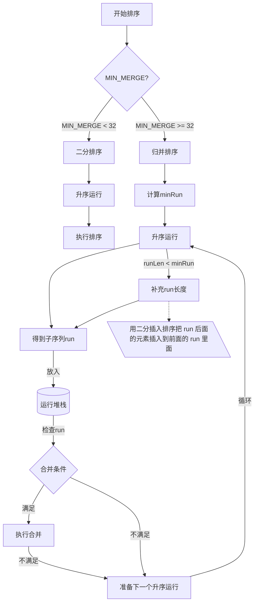

# 背景

Timsort 是一个混合、稳定的排序算法，简单来说就是**归并排序**和**二分插入排序**算法的混合体，号称世界上最好的排序算法。Timsort一直是 Python 的标准排序算法。Java SE 7 后添加了Timsort API ，我们从`Arrays.sort`可以看出它已经是**非原始类型数组**的默认排序算法了。所以不管是进阶编程学习还是面试，理解 Timsort 是比较重要。

```java
// List sort()    
default void sort(Comparator<? super E> c) {
        Object[] a = this.toArray();
  			//数组排序
        Arrays.sort(a, (Comparator) c);
  			...
    }

// Arrays.sort
    public static <T> void sort(T[] a, Comparator<? super T> c) {
        if (c == null) {
            sort(a);
        } else {
          	// 废弃版本
            if (LegacyMergeSort.userRequested)
                legacyMergeSort(a, c);
            else
                TimSort.sort(a, 0, a.length, c, null, 0, 0);
        }
    }

    public static void sort(Object[] a) {
        if (LegacyMergeSort.userRequested)
            legacyMergeSort(a);
        else
            ComparableTimSort.sort(a, 0, a.length, null, 0, 0);
    }
```


# 前置知识

理解 Timsort 需要先回顾下面的知识。


## 指数搜索

指数搜索，也被称为加倍搜索，是一种用于在大型数组中搜索元素而创建的算法。它是一个两步走的过程。首先，该算法试图找到目标元素存在的范围 `(L，R)`，然后在这个范围内使用二叉搜索来寻找目标的准确位置。时间复杂度为 $O(\lg n)$。该搜索算法在大量有序数组中比较有效。


## 二分插入排序

插入排序算法很简单，大体过程是从第二个元素开始，依次向前移动交换元素直到找到合适的位置。


插入排序最优时间复杂度也要 $O(n)$ ，我们可以使用二分查找来减少插入时元素的比较次数，将时间复杂度降为 $\log n$。但是注意，二分查找插入排序仍然需要移动相同数量的元素，但是复制数组的时间消耗低于逐一互换操作。

特点：**二分插入排序主要优点是在小数据集场景下排序效率很高。**

```java
    public static int[] sort(int[] arr) throws Exception {
        // 开始遍历第一个元素后的所有元素
        for (int i = 1; i < arr.length; i++) {
            // 需要插入的元素
            int tmp = arr[i];
            // 从已排序最后一个元素开始，如果当前元素比插入元素大，就往后移动
            int j = i;
            while (j > 0 && tmp < arr[j - 1]) {
                arr[j] = arr[j - 1];
                j--;
            }
            // 将元素插入
            if (j != i) {
                arr[j] = tmp;
            }
        }
        return arr;
    }

    public static int[] binarySort(int[] arr) throws Exception {
        for (int i = 1; i < arr.length; i++) {
            // 需要插入的元素
            int tmp = arr[i];
            // 通过二分查找直接找到插入位置
            int j = Math.abs(Arrays.binarySearch(arr, 0, i, tmp) + 1);
            // 找到插入位置后，通过数组复制向后移动，腾出元素位置
            System.arraycopy(arr, j, arr, j + 1, i - j);
            // 将元素插入
            arr[j] = tmp;
        }
        return arr;
    }
```


## 归并排序

归并排序是利用分治策略的算法，包含两个主要的操作：**分割**与**合并**。大体过程是，通过递归将数组不断分成两半，一直到无法再分割（也就是数组为空或只剩一个元素），然后进行合并排序。简单来说合并操作就是不断取两个较小的排序数组然后将它们组合成一个更大的数组。

特点：**归并排序主要为大数据集场景设计的排序算法。**


```java
public static void mergeSortRecursive(int[] arr, int[] result, int start, int end) {
        // 跳出递归
        if (start >= end) {
            return;
        }
        // 待分割的数组长度
        int len = end - start;
        int mid = (len >> 1) + start;
        int left = start; // 左子数组开始索引
        int right = mid + 1; // 右子数组开始索引
        // 递归切割左子数组，直到只有一个元素
        mergeSortRecursive(arr, result, left, mid);
        // 递归切割右子数组，直到只有一个元素
        mergeSortRecursive(arr, result, right, end);
        int k = start;
        while (left <= mid && right <= end) {
            result[k++] = arr[left] < arr[right] ? arr[left++] : arr[right++];
        }
        while (left <= mid) {
            result[k++] = arr[left++];
        }
        while (right <= end) {
            result[k++] = arr[right++];
        }
        for (k = start; k <= end; k++) {
            arr[k] = result[k];
        }
    }

    public static int[] merge_sort(int[] arr) {
        int len = arr.length;
        int[] result = new int[len];
        mergeSortRecursive(arr, result, 0, len - 1);
        return arr;
    }
```


# Timsort 执行过程

算法大体过程，如果数组长度小于指定阀值（**MIN_MERGE**）直接使用二分插入算法完成排序，否则执行下面步骤：

1. 先从数组左边开始，执行**升序运行**得到一个**子序列**。

2. 将这个**子序列**放入运行堆栈里，等待**执行合并**。

3. 检查运行堆栈里的**子序列**，如果满足**合并条件**则执行合并。

4. 重复第一个步骤，执行下一个**升序运行**。

   

## 升序运行

**升序运行**就是从数组查找一段连续递增（升序）或递减（降序）子序列的过程，如果子序列为降序则将它反转为升序，也可以将这个过程简称为 `run`。比如数组 [2,3,6,4,9,30]，可以查找到三个子序列，[2,3,6]、[4,9]、[30]，或说3个 `run`。


## 几个关键阀值

**MIN_MERGE**

这是个常数值，可以简单理解为执行归并的最小阀值，如果整个数组长度小于它，就没必要执行那么复杂的排序，直接二分插入就行了。在 Tim Peter 的 C 实现中为 64，但实际经验中设置为 32 效果更好，所以 java 里面此值为 32。

> 降序反转时为保证稳定性，相同元素不会被颠倒。

**minrun**

在合并序列的时候，如果 `run` 数量等于或者略小于 2 的幂次方的时候，合并效率最高；如果略大于 2 的幂次方，效率就会显著降低。所以为了提高合并效率，需要尽量控制每个 `run` 的长度，通过定义一个 **minrun** 来表示每个 `run` 的最小长度，如果长度太短，就用二分插入排序把 `run` 后面的元素插入到前面的 `run` 里面。

一般在执行排序算法之前，会先计算出这个 minrun（它是根据数据的特点来进行自我调整），minrun 会从32到64选择一个数字，因此数据的大小除以 minrun 等于或略小于 2 的幂次方。比如长度是 65 ，那么 minrun 的值就是 33；如果长度是 165，minrun 就是 42。

看下 Java 里面的实现，如果**数据长度**（n） < MIN_MERGE，则返回数据长度。如果**数据长度**恰好是 2 的幂次方，则返回MIN_MERGE/2
也就是16，否则返回一个MIN_MERGE/2 <= k <= MIN_MERGE范围的值k，这样可以使的 n/k 接近但严格小于 2 的幂次方。

```java
    private static int minRunLength(int n) {
        assert n >= 0;
        int r = 0;      // 如果低位任何一位是1，就会变成1
        while (n >= MIN_MERGE) {
            r |= (n & 1);
            n >>= 1;
        }
        return n + r;
    }
```


**MIN_GALLOP**

MIN_GALLOP 是为了优化合并的过程设定的一个阈值，控制进入 `GALLOP` 模式中， `GALLOP` 模式放在后面讲。

下面是 Timsort 执行流程图





# 运行合并

当栈里面的 `run` 满足合并条件时，它就将栈里面相邻的两个run 进行合并。

## 合并条件

Timsort 为了执行平衡合并（让合并的 run 大小尽可能相同），制定了一个合并规则，对于在栈顶的三个run，分别用X、Y 和 Z 表示他们的长度，其中 X 在栈顶，它们必须始终维持一下的两个规则：
$$
Z > Y + X \\
Y > X
$$
一旦有其中的一个条件不被满足，则将 Y 与 X 或 Z 中的较小者合并生成新的 `run`，并再次检查栈顶是否仍然满足条件。如果不满足则会继续进行合并，直至栈顶的三个元素都满足这两个条件，如果只剩两个`run`，则满足 Y > X 即可。

如下下图例子

- 当 Z <= Y+X ，将 X+Y 合并，此时只剩下两个run。
- 检测 Y < X ，执行合并，此时只剩下 X，则退出合并检测。


我们看下 Java 里面的合并实现

```java
    private void mergeCollapse() {
      
       // 当存在两个以上run执行合并检查
        while (stackSize > 1) {

          // 表示 Y
            int n = stackSize - 2; 
           
          // Z <= Y + X 
            if (n > 0 && runLen[n-1] <= runLen[n] + runLen[n+1]) { 

              // 如果 Z < X 合并Z+Y ，否则合并X+Y
              if (runLen[n - 1] < runLen[n + 1])
                    n--;
                
                // 合并相邻的两个run，也就是runLen[n] 和 runLen[n+1]
                mergeAt(n); 
            } else if (runLen[n] <= runLen[n + 1]) {
                
                // Y <= X 合并 Y+X
                mergeAt(n);
            } else {
                
                // 满足两个条件，跳出循环
                break; 
            }
        }
    }
```


## 合并内存开销

原始归并排序空间复杂度是 $O(n)$ 也就是数据大小。为了实现中间项，Timsort 进行了一次归并排序，时间开销和空间开销都比  $O(n)$ 小。

优化是为了尽可能减少数据移动，占用更少的临时内存，先找出需要移动的元素，然后将较小序列复制到临时内存，在按最终顺序排序并填充到组合序列中。

比如我们需要合并 X [1, 2, 3, 6, 10] 和 Y [4, 5, 7, 9, 12, 14, 17]，X 中最大元素是10，我们可以通过二分查找确定，它需要插入到 Y 的第 5个位置才能保证顺序，而 Y 中最小元素是4，它需要插入到 X 中的第4个位置才能保证顺序，那么就知道了[1, 2, 3] 和 [12, 14, 17] 不需要移动，我们只需要移动 [6, 10] 和 [4, 5, 7, 9]，然后只需要分配一个大小为 2 临时存储就可以了。


## 合并优化

在归并排序算法中合并两个数组需要一一比较每个元素，为了优化合并的过程，设定了一个阈值 MIN_GALLOP，当B中元素向A合并时，如果A中连续 MIN_GALLOP 个元素比B中某一个元素要小，那么就进入GALLOP模式。

根据基准测试，比如当A中连续7个以上元素比B中某一元素小时切入该模式效果才好，所以初始值为7。

当进入GALLOP模式后，搜索算法变为指数搜索，分为两个步骤，比如想确定 A 中元素x在 B 中确定的位置

- 首先在 B 中找到合适的索引区间$(2^{k − 1}, 2^{k+1} - 1)$ 使得 x 元素在这个范围内；
- 然后在第一步找到的范围内通过二分搜索来找到对应的位置。

只有当一次运行的初始元素不是另一次运行的前七个元素之一时，驰骋才是有益的。这意味着初始阈值为 7。
