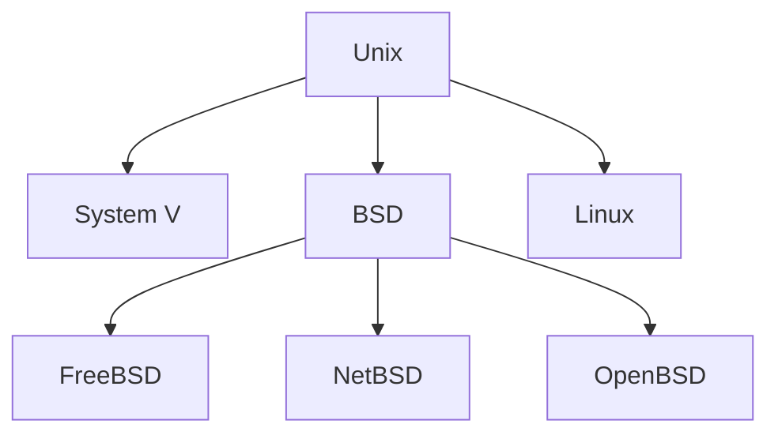

# 什么是操作系统？

操作系统( OS ) 是管理计算机硬件、并为计算机程序提供通用服务的系统软件。应用程序运行在操作系统上，操作系统协调硬件分配内存给应用程序并进行进程管理，它同时还处理操作网络与管理文件系统等基本事务。

# 操作系统有哪些？

操作系统通常已被预装在你购买的任何计算机上，个人计算机最常用的三种操作系统：

- 微软Microsoft Windows；
- 苹果Mac OS X；
- Linux。

## Microsoft Windows

20世纪80年代中期美国微软公司（Microsoft）创建的 Windows 操作系统。最新版本Windows 11（2021年发布），它是世界上最流行的操作系统。

## Mac OS X

Mac OS是由美国苹果公司（Apple）创建的一套操作系统。目前最新版本 macOS Monterey（版本 12）。

## Linux

Linux是一个开源的操作系统系列，这意味着它们可以被世界各地的任何人修改和分发。这与Windows这样的专有软件不同，后者只能由拥有它的公司进行修改。Linux的优点是它是免费的，且有许多不同的版本可供选择。

# Unix和类Unix操作系统

Unix 作为现代操作系统的基石，有着重要的影响力。 Unix 最初是用汇编语言编写的，后面又用 C 重写，重写后发展成为一个庞大而复杂的相互关联的操作系统系列。像上面提到的 Macos 和 Linux 包括 Android 都属于类 Unix 系统。Unix主要的几个子类别，包括System V、BSD和Linux。FreeBSD、NetBSD和OpenBSD

下面是Unix发展时间轴

# 操作系统功能

操作系统位于底层硬件与用户之间，是两者沟通的桥梁。用户可以通过操作系统的用户界面，输入命令。操作系统则对命令进行解释，驱动硬件设备，实现用户要求。一个标准PC的操作系统应该提供以下的功能：

- 进程管理（Processing management）
- 内存管理（Memory management）
- 文件系统（File system）
- 网络通信（Networking）
- 安全机制（Security）
- 用户界面（User interface）
- 驱动程序（Device drivers）

## 进程管理

在操作系统里，应用程序的执行单位是**进程**。计算机刚出来的时候，每个CPU最多只能同时执行一个进程。早期的操作系统（例如DOS）也不允许任何程序打破这个限制，且DOS同时只有执行一个进程。现代的操作系统，即使只有一个CPU，也可以利用多进程（multitask）功能同时执行多个进程。进程管理指的是操作系统调整多个进程的功能。

由于大部分的电脑只包含一个CPU，在宏内核（Core）的场景下多进程只是简单迅速地切换各进程，让每个进程都能够执行，在多内核或多处理器的场景下，所有进程透过许多协同技术在各处理器或内核上转换。越多进程同时执行，每个进程能分配到的时间比率就越小。很多操作系统在遇到此问题时会出现诸如音效断续或鼠标跳格的情况（称做颠簸（Thrashing），一种操作系统只能不停执行自己的管理程序并耗尽系统资源的状态，其他用户或硬件的程序皆无法执行。进程管理通常实践了分时的概念，大部分的操作系统可以利用指定不同的特权等级（priority），为每个进程改变所占的分时比例。特权越高的进程，执行优先级越高，单位时间内占的比例也越高。交互式操作系统也提供某种程度的反馈机制，让直接与用户交互的进程拥有较高的特权值。

除了进程管理之外，操作系统尚有担负起进程间通信（IPC）、进程异常终止处理以及死锁（Dead Lock）侦测及处理等较为艰深的问题。

在进程之下尚有线程的问题，但是大部分的操作系统并不会处理线程所遭遇的问题，通常操作系统仅止于提供一组API让用户自行操作或透过虚拟机的管理机制控制线程之间的交互。

## 内存管理

多进程操作系统内核必须负责管理程序当前正在使用的所有系统内存。这确保了一个程序不会干扰另一个程序已经在使用的内存。由于程序是分时的，每个程序都必须独立访问内存。

许多早期操作系统使用的协同内存管理假设所有程序都自愿使用内核的内存管理器，并且不会超出其分配的内存。这种内存管理系统几乎再也见不到了，因为程序经常包含可能导致它们超出分配的内存的错误。如果一个程序失败，它可能会导致一个或多个其他程序使用的内存受到影响或覆盖。恶意程序或病毒可能会故意改变另一个程序的内存，或者可能会影响操作系统本身的运行。通过协作内存管理，只需一个行为不端的程序就可以使系统崩溃。

内存保护使内核能够限制进程对计算机内存的访问。存在各种内存保护方法，包括内存分段和分页。所有方法都需要某种程度的硬件支持（例如80286 MMU），这并非在所有计算机中都存在。

在分段和分页中，某些保护模式寄存器向 CPU 指定它应该允许正在运行的程序访问的内存地址。尝试访问其他地址会触发中断，这会导致 CPU 重新进入管理模式，让内核负责。这被称为分段违规或简称 Seg-V，因为既难以为这样的操作分配有意义的结果，又因为它通常是程序行为不端的标志，内核通常会终止有问题的程序，并报告错误。

Windows 3.1 至 ME 具有一定程度的内存保护，但程序可以轻松规避使用它的需要。将产生一般保护错误，表明发生了分段违规；但是，无论如何，系统经常会崩溃。

## 虚拟内存

使用虚拟内存寻址（例如分页或分段）意味着内核可以选择每个程序在任何给定时间可以使用的内存，允许操作系统为多个任务使用相同的内存位置。

如果一个程序试图访问不在其当前可访问内存范围内的内存，但仍然已分配给它，则内核会以与程序超出其分配的内存时相同的方式中断。（请参阅内存管理部分。）在 UNIX 下，这种中断称为缺页。

当内核检测到页面错误时，它通常会调整触发它的程序的虚拟内存范围，授予它访问请求的内存的权限。这使内核可以自行决定特定应用程序的内存存储在哪里，甚至它是否已经实际分配。

在现代操作系统中，访问频率较低的内存可以临时存储在磁盘或其他媒体上，以使该空间可供其他程序使用。这称为交换，因为一个内存区域可以被多个程序使用，并且该内存区域包含的内容可以按需交换或交换。

“虚拟内存”为程序员或用户提供了一种感觉，即计算机中的 RAM 量比实际内存量大得多。

## 多任务处理

多任务处理是指在同一台计算机上运行多个独立的计算机程序，看起来它正在同时执行任务。由于大多数计算机一次最多只能做一两件事，这通常是通过分时完成的，这意味着每个程序都使用计算机的一部分时间来执行。

操作系统内核包含一个调度程序，该程序确定每个进程花费多少时间执行，以及应以何种顺序将执行控制传递给程序。控制权由内核传递给进程，允许程序访问CPU和内存。之后，通过某种机制将控制权交还给内核，这样就可以允许另一个程序使用 CPU。这种内核和应用程序之间所谓的控制传递称为上下文切换。

控制程序时间分配的早期模型称为协作多任务处理。在此模型中，当内核将控制权传递给程序时，它可以执行任意长的时间，然后再将控制权显式返回给内核。这意味着恶意或故障程序不仅可能阻止任何其他程序使用 CPU，而且如果它进入无限循环，它可能会挂起整个系统。

现代操作系统将应用程序抢占的概念扩展到设备驱动程序和内核代码，因此操作系统也可以对内部运行时进行抢占控制。

管理抢占式多任务的理念是确保所有程序在 CPU 上都有固定的时间。这意味着必须限制所有程序在不被中断的情况下允许它们在 CPU 上花费的时间。为了实现这一点，现代操作系统内核利用了定时中断。保护模式计时器由内核设置，在指定的时间过去后触发返回到超级用户模式。（请参阅上面有关中断和双模式操作的部分。）

在许多单用户操作系统上，协作多任务处理是完全足够的，因为家用计算机通常运行少量经过良好测试的程序。AmigaOS是一个例外，从它的第一个版本开始就有抢占式多任务处理。Windows NT是第一个强制执行抢占式多任务处理的Microsoft Windows版本，但它直到Windows XP才进入家庭用户市场（因为Windows NT是针对专业人士的）。

## 文件系统

所谓的文件系统，通常指称管理磁盘资料的系统，可将资料以目录或文件的型式存储。每个文件系统都有自己的特殊格式与功能，例如日志管理或不需磁盘重整。

操作系统拥有许多种内置文件系统。例如Linux拥有非常广泛的内置文件系统，如ext2、ext3、ext4、ReiserFS、Reiser4、GFS、GFS2、OCFS、OCFS2、NILFS与Google文件系统。Linux也支持非原生文件系统，例如XFS、JFS、FAT家族与NTFS。另一方面，Windows能支持的文件系统衹有FAT12、FAT16、FAT32、EXFAT与NTFS。NTFS系统是Windows上最可靠与最有效率的文件系统。其他的FAT家族都比NTFS老旧，且对于文件长度与分割磁盘能力都有很大限制，因此造成很多问题。而UNIX的文件系统多半是UFS，而UNIX中的一个分支Solaris最近则开始支持一种新式的ZFS。

大部分上述的文件系统都有两种建置方法。系统可以以日志式或非日志式建置。日志式文件系统可以以较安全的手法执行系统恢复。如果一个没有日志式建置的文件系统遇上突然的系统崩溃，导致资料创建在一半时停顿，则此系统需要特殊的文件系统检查工具才能撤销；日志式则可自动恢复。微软的NTFS与Linux的ext3、ext4、reiserFS与JFS都是日志式文件系统。

每个文件系统都实现相似的目录／子目录架构，但在相似之下也有许多不同点。微软使用“\”符号以创建目录／子目录关系，且文件名称忽略其大小写差异；UNIX系统则是以“/”创建目录架构，且文件名称大小写有差异。(其实这是给系统调用的，"/"或"\"并不实际存在硬盘)

## 网络通讯

许多现代的操作系统都具备操作主流网络通信协议TCP/IP的能力。也就是说这样的操作系统可以进入网络世界，并且与其他系统分享诸如文件、打印机与扫描仪等资源。

许多操作系统也支持多个过去网络启蒙时代的各路网络通信协议，例如IBM创建的系统网络架构、DEC在它所生产的系统所设置的DECnet架构与微软为Windows制作的特殊通信协议。还有许多为了特殊功能而研发的通信协议，例如可以在网络上提供文件访问功能的NFS系统。现今大量用于影音流（Streaming media）及游戏消息发送的UDP协议等。

## 设备驱动程序

设备驱动程序是一种特定类型的计算机软件，开发用于允许与硬件设备进行交互。通常，这构成了一个接口，用于通过硬件连接到的特定计算机总线或通信子系统与设备进行通信，向设备提供命令和/或从设备接收数据，另一方面，为操作设备提供必要的接口。系统和软件应用程序。它是一种专门的硬件相关计算机程序，它也是操作系统特定的，它使另一个程序（通常是操作系统或应用程序软件包或在操作系统内核下运行的计算机程序）能够与硬件设备透明地交互，

设备驱动程序的关键设计目标是抽象. 每个型号的硬件（即使在同一类设备中）都是不同的。较新的型号也由提供更可靠或更好性能的制造商发布，并且这些较新型号的控制通常不同。不能指望计算机及其操作系统知道如何控制现在和将来的每个设备。为了解决这个问题，操作系统基本上规定了应该如何控制每种类型的设备。然后，设备驱动程序的功能是将这些操作系统授权的函数调用转换为特定于设备的调用。理论上，如果有合适的驱动程序可用，以新方式控制的新设备应该可以正常工作。从操作系统的角度来看，这个新驱动程序确保设备看起来像往常一样运行。

在 Vista 之前的 Windows 版本和 2.6 之前的 Linux 版本下，所有驱动程序的执行都是协作的，这意味着如果驱动程序进入无限循环，它将冻结系统。这些操作系统的最新版本包含内核抢占，其中内核中断驱动程序以给它任务，然后将自己与进程分离，直到它收到来自设备驱动程序的响应，或者给它更多任务去做。

# Linux

为什么要学习 Linux ？

现代智能手机、个人计算机、服务器、汽车和各种嵌入式设备Linux 无处不在，所以无论你是做服务器开发、APP开发、嵌入式开发都离不开Linux。

## Linux 组成

Linux 操作系统由下面几个重要部分组成：

1. **引导加载程序（Bootloader）**： 是将操作系统放入内存的小程序，管理系统启动。Linux 有两个最常见的引导加载程序 LILO (LInux LOader) 和 LOADLIN (LOAD LINux)。
2. **内核（Kernel）**：内核是系统的核心，管理着 CPU、内存和外围设备。内核是 Linux 最重要的部分，需要重点理解。
3. **初始化系统（Init system）**：这是一个引导用户空间并负责控制守护进程的子系统。比如使用最广泛初始化系统 systemd。引导加载程序完成后进入系统初始化。
4. **守护进程（Daemons）**：这些是后台服务（打印、声音、调度等），它们要么在引导加载期间启动，要么在登录桌面后启动。
5. **图形服务器（Graphical server）**：显示器上显示图形的子系统。
6. **桌面环境（Desktop environment）**：用户交互界面。有许多桌面系统可供选择（GNOME、Cinnamon、Mate、Pantheon、Enlightenment、KDE、Xfce 等）。每个桌面环境都包含内置应用程序（例如文件管理器、配置工具、Web 浏览器和游戏）。
7. **应用程序（Applications）**：就像 Windows 和 macOS 一样，Linux 也提供了很多高质量软件，可以轻松找到和安装。例如，Ubuntu Linux 有个 Ubuntu 软件中心（GNOME 软件的更名），可以在里面搜索想要的应用程序进行安装。

> **关于引导加载程序**：**LILO** 是 Linux 主要的引导加载程序。Red Hat Linux 使用了GRUB（GRand Unified Bootloader），LILO 的主要优点是它允许快速启动，LOADLIN 有时用作备份引导加载程序，以防 LILO 失败。

## Linux 安装

制作 Linux 启动镜像

1. **下载 ISO 格式的 Linux 发行版** ISO 文件是磁盘映像。一些顶级选项是[Ubuntu](https://ubuntu.com/download/desktop)、[Mint](https://linuxmint.com/download.php)或[Fedora](https://getfedora.org/)。它们可以从每个发行版的主网站免费下载。我们使用的是 Ubuntu。

2. **将 USB 驱动器插入计算机**。系统可能会要求您格式化驱动器。这将清除驱动器上存储的所有数据，因此请务必在开始之前备份文件。

3. 制作工具有 **UNetbootin**、 **Rufus**、**universal-usb-installer**，我们就使用 Rufus。

4. **打开 Rufus 并从设备列表中选择你的 USB 驱动器**。如果你不知道要使用哪个驱动器，请弹出所有其他驱动器，直到只有一个可供选择。

5. **在引导选择下，单击选择按钮并选择您之前下载的 ISO 文件**。不要更改其他默认设置。![[rufus screenshot]](https://blogs-on.oss-cn-beijing.aliyuncs.com/imgs/202206231044641.png)

6. **最后，点击开始**。如果您收到一条弹出消息，要求您选择要用于写入映像的模式，请选择 ISO。

   

然后等待 Rufus 将您的 ISO 文件挂载到您的驱动器上。这可能需要一些时间，所以如果进度条卡住，请耐心等待。

在 Window10 上安装 Linux

1. **插入可引导的 Linux USB 驱动器**。
2. **单击开始菜单**。这是屏幕左下角的按钮，看起来像 Windows 徽标。
3. **然后在单击 Restart 的同时按住 SHIFT 键**。这将带您进入 Windows 恢复环境。
4. **然后选择使用设备**。
5. **在列表中找到您的设备**。如果您没有看到您的驱动器，请选择 EFI USB 设备，然后从下一个屏幕中选择您的驱动器。
6. **您的计算机现在将启动 Linux**。如果您的计算机重新启动 Windows，则说明您的驱动器存在问题，或者您可能需要更改 BIOS 中的设置。
7. 选择安装 Linux。一些发行版还允许您在此处安装之前试用操作系统。
8. **完成安装过程**。这将根据您尝试安装的发行版而有所不同。这些详细信息可能包括您的 WiFi 网络、语言、时区、键盘布局等。您可能还需要使用用户名和密码创建一个帐户。确保写下任何细节，因为您将来可能会需要它们。
9. **大多数发行版都允许您对驱动器进行分区或擦除它并在安装过程中进行全新安装。**
10. **出现提示时重新启动计算机**。如果您的系统中有多个操作系统，您将在重新启动后进入 GNU GRUB 屏幕。此屏幕允许您选择要启动的操作系统。

如果您在启动计算机时没有看到 GRUB 屏幕，您可以尝试在 BIOS 的启动列表中将您的 Linux 发行版移到更高的位置。

完成后，您可以进行硬件检查。在某些情况下，您可能需要下载其他驱动程序才能使某些硬件正常工作。下载驱动程序的选项可以在新 Linux 操作系统的系统设置中找到。在验证您的硬件工作正常后，您可以开始探索和使用您的 Linux 发行版。 

> [Ubuntu](https://ubuntu.com/download/desktop)：https://ubuntu.com/download/desktop
>
> [Mint](https://linuxmint.com/download.php)：https://linuxmint.com/download.php
>
> [Fedora](https://getfedora.org/) ：https://getfedora.org
>
> [rufus](https://rufus.ie)：https://rufus.ie

## Linux kernel

Linux 操作系统的架构大体包含：**内核、系统库、硬件层、系统**和**Shell 实用程序**。

### Linux 接口

Linux 内核有两类接口**应用程序编程接口 (API)**和**应用二进制接口（ABI）**，这些接口用于不同的目的，并且在设计上具有不同的属性。 

- 内核向用户空间提供的 API（**kernel–user space**）。
- 内核内部的 API（**kernel internal**） 。
- 内核向用户空间提供的 ABI（**kernel–user space**）。
- 内核内部的 ABI。

### Linux API 

它允许用户空间的程序访问 Linux 内核的系统资源和服务。[C标准库](https://en.wikipedia.org/wiki/C_standard_library)是 Linux 内核系统调用的包装器；Linux 内核系统调用接口和 C 标准库的组合构成了 Linux API。

**内核内部的 API**

有很多内核内部的 API 供所有子系统相互接口。这些都保持相当稳定，但不能保证稳定。如果新的研究或见解使更改看起来有利，则更改 API，所有必要的重写和测试都必须由作者完成。

Linux 内核是一个单片内核，因此设备驱动程序是内核组件。为了减轻公司在树外维护其（专有）设备驱动程序的负担，反复要求设备驱动程序的稳定 API。Linux 内核开发人员一再否认为设备驱动程序提供稳定的内核 API。保证这一点在过去会阻碍 Linux 内核的开发，并且在未来仍然会如此，并且由于自由和开源软件的性质，没有必要。因此，可以选择，Linux 内核没有稳定的内核 API。

### Linux ABI

应用程序二进制接口是指机器码中编译的二进制文件。因此，任何此类 ABI 都绑定到指令集。定义一个有用的 ABI 并保持其稳定不是 Linux 内核开发人员或 GNU C 库开发人员的责任，而更多的是希望出售并为其提供支持的Linux 发行版和独立软件供应商(ISV) 的任务。专有软件作为二进制文件仅适用于这样一个 Linux ABI，而不是支持多个 Linux ABI。

必须为每个指令集定义一个 ABI，例如x86、x86-64、MIPS、ARMv7-A（32 位）、ARMv8-A（64 位）等，如果两者都支持的话。

它应该能够根据 ABI 中指定的定义使用不同的编译器编译软件，并实现完全的二进制兼容性。自由和开源软件的编译器有GNU Compiler Collection、LLVM / Clang。

> [Linux](https://www.kernel.org)：https://www.kernel.org

## 进程和线程

Linux 通过系统调用（clone(2) 或 clone3(2)）来创建进程。根据给定的参数，新实体可以共享调用者的大部分资源，也可以不共享。这些系统调用可以创建新实体，范围从新的独立进程（每个进程在内核空间的task_struct数据结构中都有一个称为TGID的特殊标识符，尽管在用户空间中该标识符称为PID），到调用进程中的新执行线程（通过使用CLONE_THREAD参数）。在后一种情况下，新实体拥有调用进程的相同TGID，因此也具有相同的用户空间中的PID。

如果可执行文件动态链接到共享库，则使用动态链接器（对于 ELF 对象，通常是/lib/ld-linux.so.2）来查找和加载所需的对象，准备程序运行然后运行它。

Native POSIX 线程库，简称为 NPTL，为用户空间提供标准的 POSIX 线程接口（pthreads）。每当使用 pthread_create(3) POSIX 接口创建新线程时，系统调用的clone(2)系列也必须给出新线程必须跳转到的函数地址。Linux 内核提供了futex(7)（“Fast user-space mutexes”的首字母缩写）机制来实现快速用户空间锁定和同步；大多数操作是在用户空间中执行的，但可能需要使用futex(2)与内核进行通信系统调用。

一个非常特殊的线程类别是所谓的内核线程。不要将它们与上述用户进程的执行线程混淆。内核线程只存在于内核空间中，它们的唯一目的是并发运行内核任务。不同的是，无论何时创建一个独立的进程，系统调用都会准确地返回到同一程序的下一条指令，同时在父进程和子进程中（即一个程序，两个进程）。不同的返回值（每个进程一个）使程序能够知道它当前正在执行的两个进程中的哪一个。程序需要这些信息，因为子进程，在进程复制后几步，通常调用execve(2)系统调用（可能通过 glibC 中的exec(3)包装函数系列）并替换当前正在运行的程序带有新程序的调用进程，带有新初始化的堆栈、堆和（已初始化和未初始化的）数据段。

根据有效用户 id ( euid ) 和有效组 id ( egid )，以用户零权限运行的进程（root，系统管理员，拥有标识符 0）可以执行所有操作（例如，杀死所有其他进程或递归清除整个文件系统），而不是非零用户进程不能。能力（7）将传统上与超级用户相关的特权划分为不同的单元，这些单元可以由父进程独立启用和禁用，也可以由子进程本身删除。

## 调度和抢占

Linux 调度程序是模块化的，因为它支持不同的调度类和策略。调度程序类是可插入调度程序算法，可以使用基本调度程序代码注册。每个类安排不同类型的进程。调度程序的核心代码按优先级顺序遍历每个类，并选择具有准备运行的 struct sched_entity 类型的可调度实体的最高优先级调度程序。实体可以是线程、线程组，甚至是特定用户的所有进程。

Linux 既提供用户抢占，也提供完整的内核抢占。抢占减少了延迟，提高了响应能力，并使 Linux 更适合桌面和实时应用程序。

对于普通任务，默认情况下，内核使用完全公平调度程序(CFS) 类，该类在 2.6.23 版本的内核中引入。在内部，这个默认调度程序类在 C 头文件的宏中定义为SCHED_NORMAL. 在其他 POSIX 内核中，类似的策略称为SCHED_OTHER分配 CPU 时间片（即，它根据每个进程的预定或动态计算的优先级分配处理器时间的绝对片）。Linux CFS 取消了绝对时间片并分配了相当比例的 CPU 时间，作为可运行进程总数和它们已经运行的时间等参数的函数；此函数还考虑了一种取决于它们的相对优先级（好的值）的权重。

通过用户抢占，内核调度程序可以通过执行上下文切换来替换当前进程，从而获得运行所需的计算资源（CPU、内存等）。它根据CFS算法（特别是，它使用称为vruntime的变量对实体进行排序，然后选择具有较小 vruntime 的变量，即 CPU 时间份额最少的可调度实体），以活动调度程序策略和相对优先级。通过内核抢占，内核可以在中断处理程序返回、内核任务阻塞以及子系统显式调用 schedule() 函数时抢占自身。

## 中断管理

中断的管理，虽然它可以被视为一个单独的工作，但被分成两个独立的部分。这种分成两部分是由于不同的时间限制和组成管理的任务的同步需求。第一部分由异步中断服务例程组成，在 Linux 中称为上半部分，而第二部分由三种所谓的下半部分（softirq、tasklet和工作队列）之一执行。Linux 中断服务程序可以嵌套（即，一个新的 IRQ 可以陷入一个高优先级的 ISR 中，该 ISR 会抢占任何其他低优先级的 ISR）。

# 参考

https://en.wikipedia.org/wiki/Operating_system

https://zh.wikipedia.org/wiki/%E6%93%8D%E4%BD%9C%E7%B3%BB%E7%BB%9F

https://zh.wikipedia.org/zh-hk/Linux%E5%86%85%E6%A0%B8
